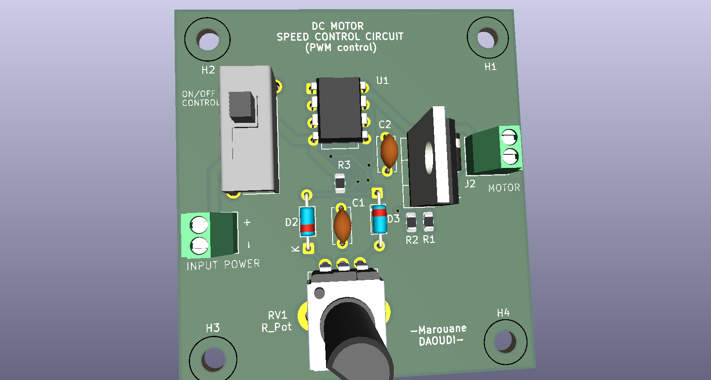
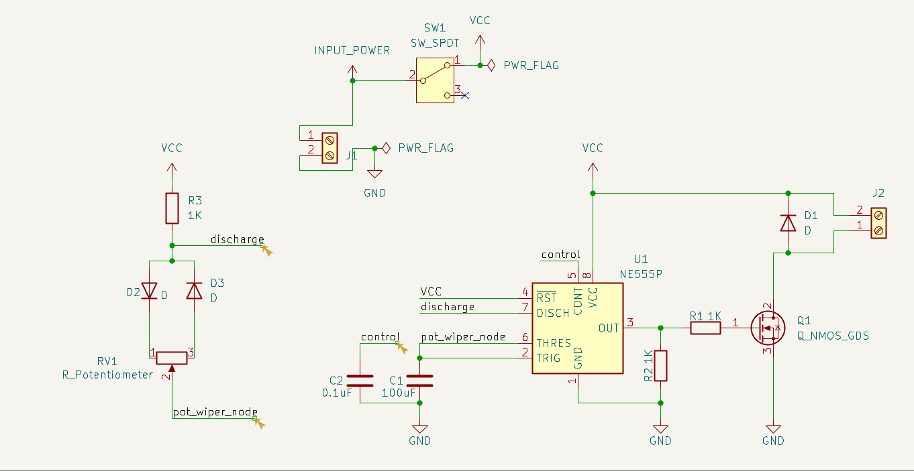
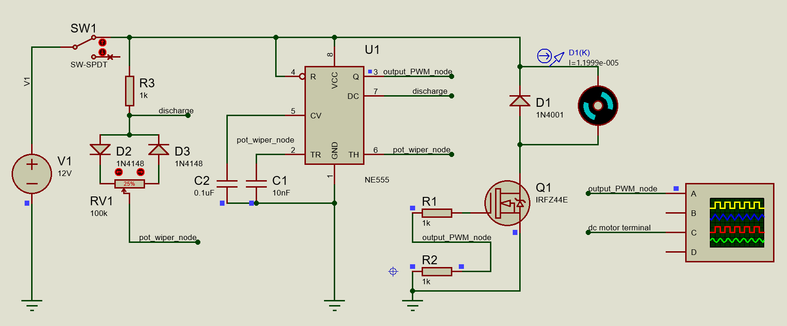
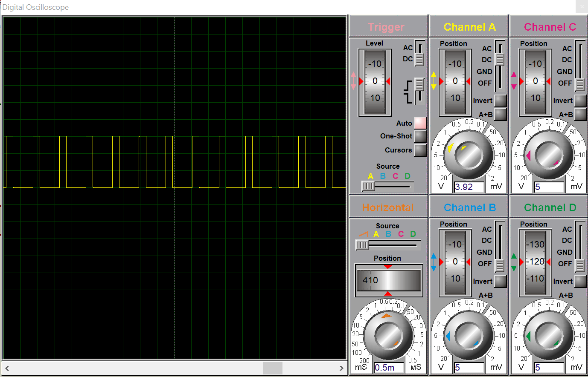
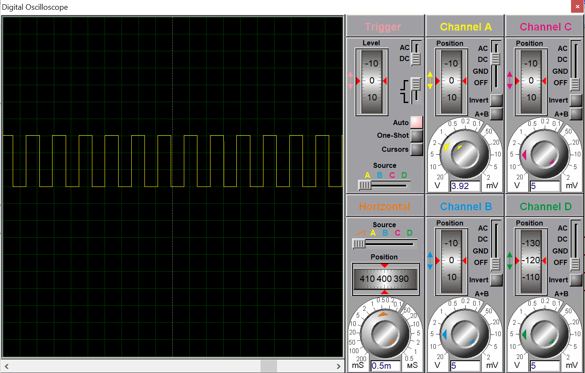
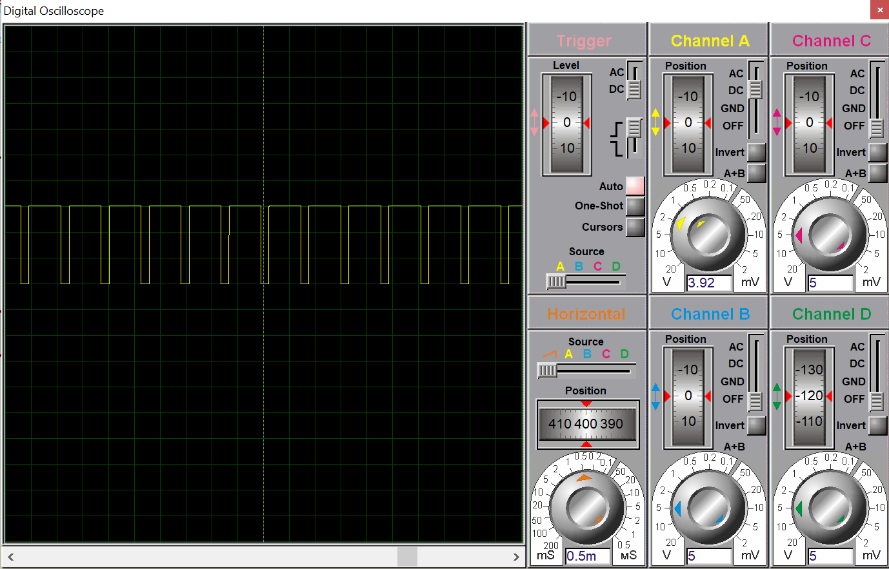
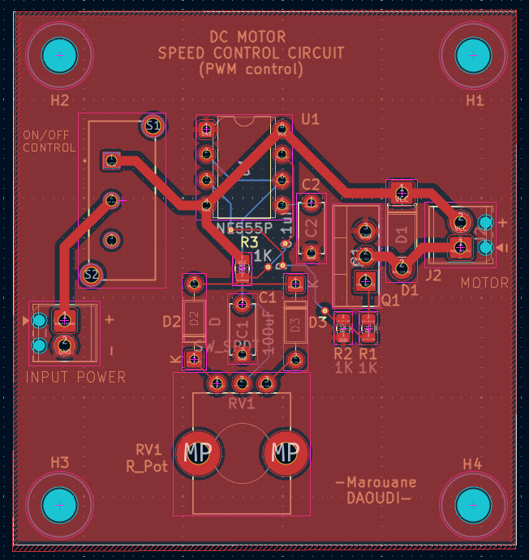
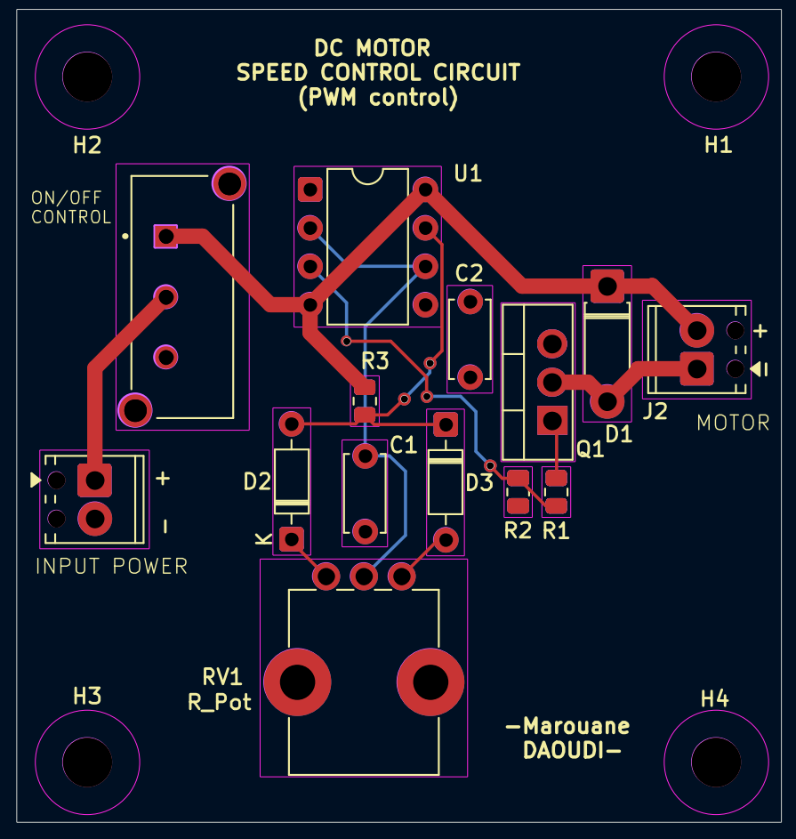

# DC Motor PWM Speed Controller

A 2-layer PCB implementing a variable-speed DC motor controller 
using pulse-width modulation (PWM). The PWM signal is generated 
by a 555 timer in astable mode with an adjustable duty cycle 
controlled by a potentiometer. The design covers the full 
engineering workflow from circuit simulation in Proteus through 
PCB layout in KiCad to manufacturer-ready Gerber files.

---

## Specifications

| Parameter | Value |
|---|---|
| Supply voltage | 12V DC |
| Motor no-load current | 1.4A |
| MOSFET (Q1) | IRFZ44N — 49A continuous drain current |
| PWM frequency | ~1kHz–20kHz (adjustable via pot) |
| Duty cycle range | ~10% to ~90% |
| Timer IC | NE555 / LM555CN |
| Timing capacitor | 10nF ceramic |
| Speed control | 100kΩ potentiometer |
| PCB layers | 2-layer FR4 |
| Design tool | KiCad |
| Simulation tool | Proteus |

---

## Schematic

---

## How it works

### Why a MOSFET is needed

The LM555CN timer can source or sink a maximum of 200mA at its 
output pin. The DC motor used in this design draws 1.4A under 
no-load conditions — well beyond what the timer can drive 
directly. The IRFZ44N N-channel MOSFET (Q1) solves this by 
acting as a power switch controlled by the 555 output signal. 
With a rated continuous drain current of 49A and a low 
drain-to-source on-resistance, it handles the full motor current 
while being driven by the low-power 555 output.

### 555 timer PWM generation

The NE555 is configured in astable mode, continuously 
oscillating to produce a PWM square wave at pin 3 
(output_PWM_node). The key connections are:

- **Pin 8 (VCC)** → 12V power net
- **Pin 1 (GND)** → ground
- **Pin 4 (RESET)** → tied to VCC to keep the timer permanently 
  enabled (active LOW pin — must not be grounded)
- **Pin 5 (CV)** → bypassed to GND via 0.1µF ceramic capacitor 
  C2 to filter noise on the internal voltage divider and prevent 
  accidental frequency override
- **Pins 2 and 6** → connected together at the same node 
  (pot_wiper_node), feeding the same voltage to both internal 
  comparators of the 555 to sustain continuous oscillation

### Timing network and duty cycle control

The timing capacitor C1 (10nF ceramic) connects from 
pot_wiper_node to GND. Its charge and discharge paths are 
separated by two 1N4148 diodes (D2 and D3) and the 100kΩ 
potentiometer RV1, which is the key to independent duty cycle 
control:

- **Charge path (Ton):** current flows from VCC → R3 (1kΩ) → 
  D2 → left side of pot → wiper → C1 → GND
- **Discharge path (Toff):** C1 discharges through wiper → 
  right side of pot → D3 → pin 7 (discharge) → internal 
  transistor of 555 → GND

The 1N4148 diodes are rated for 300mA forward current, 
which is appropriate since the timing resistors are in the 
kΩ range and limit current well below this threshold.
The timing equations are:

$$
T_{on} = 0.693 \times (R_3 + R_{pot,left}) \times C_1
$$

$$
T_{off} = 0.693 \times R_{pot,right} \times C_1
$$

$$
T = T_{on} + T_{off}
$$

$$
f = \frac{1}{T}
$$

$$
D = \frac{T_{on}}{T_{on} + T_{off}}
$$

Rotating the potentiometer shifts resistance between the left 
and right sides, changing the Ton/Toff ratio and therefore the 
duty cycle — while the frequency stays approximately constant. 
The 10nF capacitor was chosen to produce a high PWM frequency 
(~1kHz and above), which ensures smooth motor rotation without 
audible buzzing or torque ripple.

Pin 7 (discharge) connects to the D3 node to complete the 
discharge route through the 555's internal transistor switch 
between pin 7 and pin 1.

### MOSFET gate drive

The PWM signal at output_PWM_node drives the gate of Q1 
(IRFZ44N) through two resistors:

- **R1 (1kΩ)** in series between pin 3 and the gate — limits 
  gate current and dampens switching ringing, also provides 
  protection if the MOSFET malfunctions
- **R2 (1kΩ)** from the gate node to GND — provides a 
  discharge path for the gate capacitance when the 555 output 
  goes LOW, ensuring the gate discharges cleanly to 0V and 
  preventing the MOSFET from remaining partially ON due to 
  residual gate charge

The MOSFET source connects directly to GND. Its drain connects 
to the negative terminal of the motor.

### Motor switching principle

When the 555 output is HIGH, the gate receives sufficient 
voltage to turn Q1 fully ON. The drain-to-source channel 
closes, completing the current path:

`12V → SW1 → Motor (+) → Motor (−) → MOSFET Drain → MOSFET Source → GND`

The motor runs. When the 555 output goes LOW, the gate 
discharges through R2, Q1 turns OFF, the current path breaks, 
and the motor coasts. This switching repeats at the PWM 
frequency. The motor's mechanical inertia averages the 
delivered power, producing a speed proportional to duty cycle:

$$
V_average = Duty cycle  ×  V_supply
$$

At 50% duty cycle the motor receives an effective average of 
6V. At 90% it receives approximately 10.8V — near full speed.

### Flyback protection

The DC motor is an inductive load. When Q1 switches OFF 
abruptly, the collapsing magnetic field in the motor coil 
generates a back-EMF voltage spike that can significantly 
exceed the supply voltage. D1 (1N4001) is placed across the 
motor terminals in reverse bias. This diode was chosen for its 
high peak current rating, providing a safe recirculating path 
for the back-EMF current and clamping the spike before it can 
damage Q1.

### ON/OFF control

SW1 (SPDT switch) is placed between the power supply input 
connector J1 and the power net. It provides a hard power 
cutoff independent of the potentiometer setting, allowing 
the motor to be stopped completely without adjusting speed 
control.

---

## Simulation

Circuit simulated and verified in Proteus before PCB layout.

### Waveforms

**Low duty cycle — low motor speed:**

**Medium duty cycle — medium motor speed:**

**High duty cycle — full motor speed:**

### Simulation findings and fixes

During simulation two issues were identified and corrected:

**Issue 1 — Wrong timing capacitor value:** The initial 
capacitor value of 100µF produced a PWM frequency of 
approximately 5Hz, far too low for motor control and 
imperceptible on standard oscilloscope settings. Correcting 
to 10nF raised the frequency to the target range, producing 
smooth motor operation.

**Issue 2 — Insufficient gate drive:** With equal 1kΩ values 
for both R1 and R2, the voltage divider effect reduced gate 
voltage to approximately 5.25V — insufficient to fully enhance 
the IRFZ44N, which requires ~10V for minimum on-resistance. 
This prevented the motor from reaching full speed at 100% 
duty cycle. The fix was confirmed by ensuring the MOSFET 
source connects directly to GND with no intervening resistance 
in the return path.

---

## PCB Layout

### Design decisions

- **Component placement** follows left-to-right signal flow — 
  power input (J1) on the left, 555 timing network in the 
  center, MOSFET and motor output (J2) on the right, 
  minimizing trace crossings and separating high-current motor 
  paths from the sensitive timing network
- **Power trace width** set to 1.5mm on motor current paths 
  to handle continuous current without resistive heating
- **Ground plane** on B.Cu layer provides a low-impedance 
  return path for all components and reduces EMI from the 
  switching MOSFET
- **Vias** used to connect front-layer components to the back 
  copper ground plane, resolving routing conflicts on a 
  2-layer board
- **D1 placement** as close as possible to J2 motor connector 
  to minimize the back-EMF inductive loop area
- **Screw terminals** for J1 and J2 for reliable external 
  wire connections without direct soldering to the board
- **Mixed assembly** — 0805 SMD for passive components 
  (compact placement), through-hole for 555 DIP-8, MOSFET 
  TO-220, potentiometer, and connectors (mechanical robustness)

---

## Manufacturing

Gerber files are in the `/gerbers` folder, verified using 
JLCPCB's online Gerber viewer. To order: zip the contents 
of the gerbers folder and upload to JLCPCB, PCBWay, or any 
standard FR4 PCB manufacturer. 2-layer board, no special 
requirements.

---

## Repository contents

| Folder | Contents |
|---|---|
| [`/kicad`](./Kicad) | KiCad schematic, PCB, and project files |
| [`/gerbers`](./gerbers) | Fabrication-ready Gerber and drill files |
| [`/simulation`](./Simulation) | Proteus simulation project file |
| [`/images`](./images) | 3D renders, PCB layout, waveform captures |

---

## Author

**Marouane Daoudi**  
Electrical Engineering student

Designed in KiCad · Simulated in Proteus
